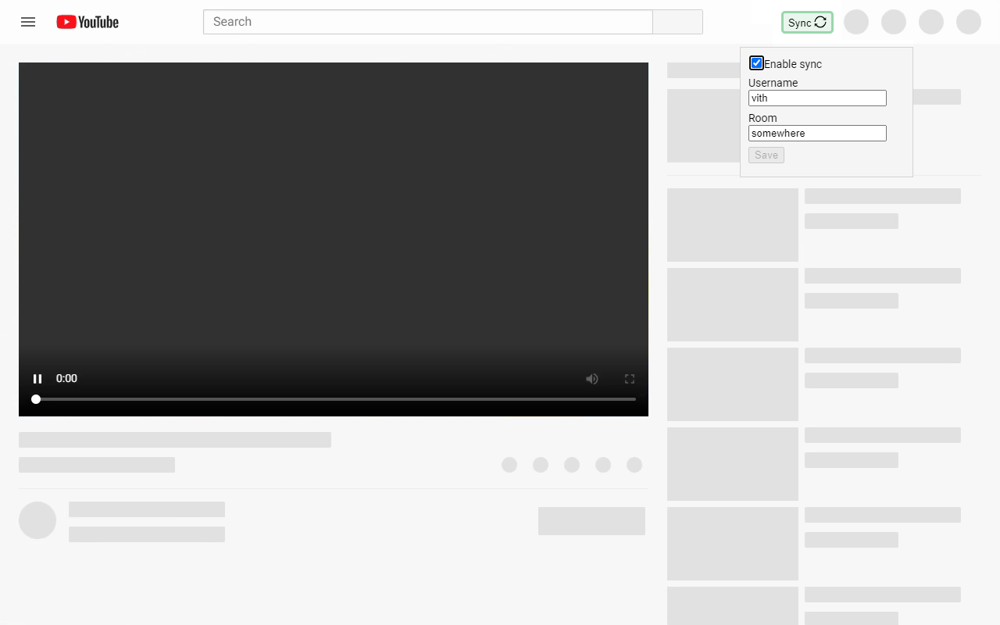

#  you2watch

_you2watch_ is a WebExtension for watching videos on YouTube in sync with your friends.

# Installation

-   **Chrome**: available on the [Chrome Web Store]

[chrome web store]: https://chrome.google.com/webstore/detail/you2watch/ebihioehgamedmkomodfopiiflljphif

# Usage

1. Click the `Sync` button in the top/right header on YouTube
2. Choose a username and room name
3. Toggle the `Enable sync` checkbox
4. Have a friend do the same
5. Play, pause, seek, or navigate to new videos
